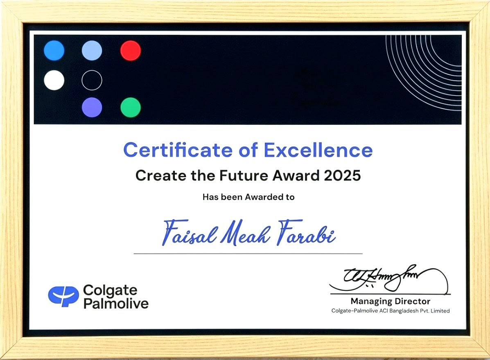

  

  
  
  

  
  

---

I bridge the gap between complex datasets and executive action. With a career built at **Colgate-Palmolive** and **Unilever**, I specialize in high-speed reporting automation and interactive BI solutions that drive nationwide sales performance.

---

## 🏆 Featured Recognition

<table>
  <tr>
    <td width="40%" align="center">
      
    </td>
    <td width="60%" style="vertical-align: middle; padding-left: 20px;">
      <h3>Create the Future Award 2025</h3>
      
<b>Colgate-Palmolive ACI Bangladesh Pvt. Limited</b>

      
Recognized for excellence in driving digital innovation and building future-ready MIS frameworks to optimize organizational efficiency. This initiative streamlined cross-functional data flows and enhanced real-time decision-making capabilities across the sales operation.

    </td>
  </tr>
</table>

---

## 🛠️ Tech Stack

  
  
  
  
  
  
  

---

## 🔍 Explore All Projects
*Browse the complete collection of my work — dashboards, automation tools, AI apps & more.*

<table width="100%">
  <thead>
    <tr>
      <th width="50%" align="center">📊 Power BI Dashboards</th>
      <th width="50%" align="center">📑 Excel Automation</th>
    </tr>
  </thead>
  <tbody>
    <tr>
      <td width="50%" align="center">Factory Performance, Sales 360, Gap Analysis & regional KPI tracking dashboards with drill-through pages.</td>
      <td width="50%" align="center">Automated KPI trackers, attendance systems & report generators using Power Query and VBA macros.</td>
    </tr>
    <tr>
      <td width="50%" align="center"><a href="https://github.com/Farabi1096/powerbi-dashboards"><b>Explore →</b></a></td>
      <td width="50%" align="center"><a href="https://github.com/Farabi1096/excel-automated-reports"><b>Explore →</b></a></td>
    </tr>
    <tr>
      <th width="50%" align="center"> 🤖 AI & Cloud Apps</th>
      <th width="50%" align="center"> ⌨️ Speed Engine</th>
    </tr>
    <tr>
      <td width="50%" align="center">AI-powered retail display audit app using Gemini API with real-time image analysis and scoring engine.</td>
      <td width="50%" align="center">Typing speed optimization project showcasing 115 WPM precision with accuracy tracking.</td>
    </tr>
    <tr>
      <td width="50%" align="center"><a href="https://github.com/Farabi1096/Retail-Automation-Portfolio"><b>Explore →</b></a></td>
      <td width="50%" align="center"><a href="https://github.com/Farabi1096/typing-tornado"><b>Explore →</b></a></td>
    </tr>
    <tr>
      <th width="50%" align="center"> 🗺️ Retail Coverage Mapper</th>
      <th width="50%" align="center"> 🔜 Coming Soon</th>
    </tr>
    <tr>
      <td width="50%" align="center">Browser-based outlet mapping tool for TA/DA verification, territory coverage analysis & route distance calculation using Leaflet.js.</td>
      <td width="50%" align="center">More projects are on the way. Stay tuned for updates.</td>
    </tr>
    <tr>
      <td width="50%" align="center"><a href="https://github.com/Farabi1096/outlet-location-tracker"><b>Explore →</b></a></td>
      <td width="50%" align="center"><b>—</b></td>
    </tr>
  </tbody>
</table>

   
  

---

## 💼 Professional Profile
* **MIS Executive** | *Colgate-Palmolive ACI Bangladesh* (Current)
* **Senior Officer – MIS** | *Unilever International*
* **Officer – MIS** | *Transcom Distribution Company Limited*

---

  <i>"Transforming raw data into operational clarity."</i>

  ⭐ <b>If you find my projects useful, consider giving them a star!</b> ⭐

